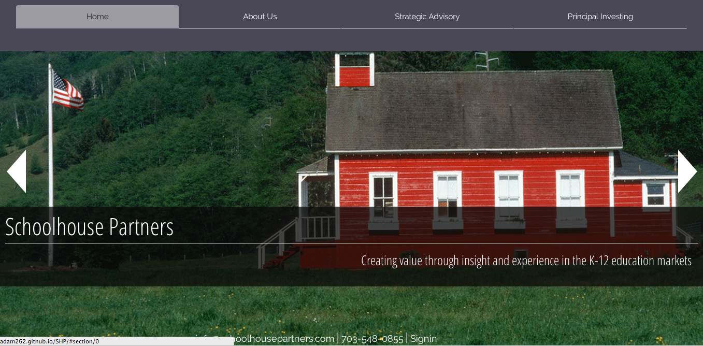
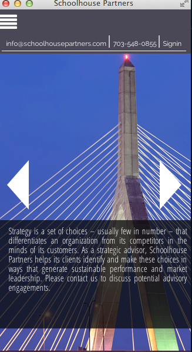
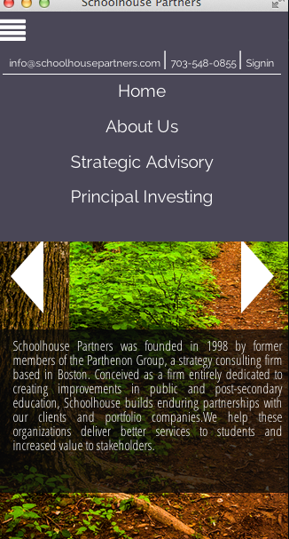

**Overview**

This is the mobile-responsive frontend redesign of a client site. The client wanted a simple, clean and visual single page app.I suggested FullPage.js as a lightweight transition library with the interesting option of horizontal sections; vertical transitions seem a lot more common in SPAs.  

**Technologies Used**

+ jQuery
+ jQuery UI
+ FullPage.js

**Screenshots**

**Get Started**

Check out the live sitet: [schoolhousepartners.com](http://schoolhousepartners.com). 
